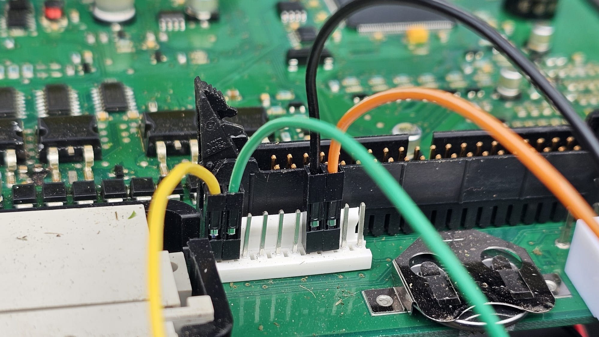

# AMConnect 

This is a basic Arduino sketch to connect to a Huqsvarna Automower generation 2 robot mower. 
In it's current state it connects to the Autoower and sends the status, location and debug data to a mqtt server, Home Assistant is used to display and control the Auromower.

Two versions were developed:
1. With GPS, based on ESP32-WROOM-32 for lolin32 - AM_GPS_Connect.ino
2. Without GPS, based on WEMOS D1 Mini Pro ESP8266 CP2104 - AMLightConnect.ino

Feel free to modify it as you see fit. 

## Hardware

### Example hardware
Cable

[Dupont Line 10/15/20CM 30CM 40Pin Male to Male + Male to Female Female to Female Jumper Wire Dupont Cable](https://www.aliexpress.com/item/1005005364298980.html?spm=a2g0o.detail.pcDetailTopMoreOtherSeller.2.2cddcz8Pcz8PlK&gps-id=pcDetailTopMoreOtherSeller&scm=1007.40050.354490.0&scm_id=1007.40050.354490.0&scm-url=1007.40050.354490.0&pvid=cd0cf94c-196a-4e9f-b0e4-1dfec2911464&_t=gps-id:pcDetailTopMoreOtherSeller,scm-url:1007.40050.354490.0,pvid:cd0cf94c-196a-4e9f-b0e4-1dfec2911464,tpp_buckets:668%232846%238112%231997&pdp_ext_f=%7B%22order%22%3A%221622%22%2C%22eval%22%3A%221%22%2C%22sceneId%22%3A%2230050%22%7D&pdp_npi=4%40dis%21CHF%211.74%211.74%21%21%2114.94%2114.94%21%40210385db17491299829837959e0857%2112000032750153124%21rec%21CH%213995943804%21XZ&utparam-url=scene%3ApcDetailTopMoreOtherSeller%7Cquery_from%3A)

GPS Version

The example hardware used for the GPS project is based around a LOLIN32 developer module and a NEO-8M  GPS.

[LOLIN32 on AliExpress](https://de.aliexpress.com/item/1005007336391647.html?spm=a2g0o.order_list.order_list_main.76.65f45c5fyYKQqe&gatewayAdapt=glo2deu)

[GPS Module on AliExpress](https://de.aliexpress.com/item/1005006495592091.html?spm=a2g0o.order_list.order_list_main.51.65f45c5fyYKQqe&gatewayAdapt=glo2deu)

As both the ESP32 and the NEO-8M module comes in alot of different forms and shapes, remember to match the settings in the configuration file with your hardware and wiring. 

Case for LOLIN32 and GPS Module 

 [LOLIN32 Case Bottom](Hardware/loin32_case_bottom.stl)

 [LOLIN32 Case Top](Hardware/loin32_case_top.stl)

 [GPS Case Bottom](Hardware/u-blox_neo_m8n_bottom.stl)

 [GPS Case Top](Hardware/u-blox_neo_m8n_top.stl)

WEMOS D1 Mini Pro (no GPS)

 [WEMOS D1 Mini Pro on AliExpress](https://de.aliexpress.com/item/1005006975974098.html?spm=a2g0o.order_list.order_list_main.66.65f45c5fyYKQqe&gatewayAdapt=glo2deu)

Case for WEMOS D1 Mini Pro

 [WEMOS D1 Mini Pro Case on Reichelt](https://www.reichelt.com/ch/de/shop/produkt/mini-abs-gehaeuse_50_x_35_x_20_mm_ip_54-121020)

Changed according to the ESP32 Pinout Reference the pins used for RX / TX see also 
[ESP32 Pinout Reference: Which GPIO pins should you use?](https://randomnerdtutorials.com/esp32-pinout-reference-gpios/)

### Pinout of the Automower header
The internal header to connect the hardware to is the white header, located just below the larger header for the main flat cable.

Pinout for the header

### Connect to Automower
In this example, the AM GPS hardware is connected to an Husqvarna Automower 230 ACX

AM no GPS Case

## Home Assitant

### Example HA

